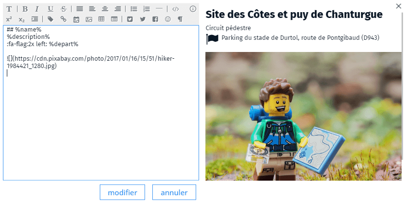

# Rédiger la carte

{: .right .small }
{: .banner }
West Indische Paskaert... Pieter Goos (Amsterdam) 1600-1699 - [Gallica BnF](https://gallica.bnf.fr/ark:/12148/btv1b59055606/f1.item)

## Choisir les fonds

Comme nous l'avons vu précédemment, la première étape est de [bien choisir ses fonds](../chap-2/2.1-fonds.html#choisir-ses-fonds) qui vont le plus souvent servir à asseoir ses données. Dans Ma carte, vous avez accès à tous les fonds IGN et vous pouvez ajouter [les vôtres](../chap-2/2.1-fonds.html#ajouter-dautres-fonds).

Une fois ceux-ci définis, vous pouvez ajouter vos propres données.

## Ajouter des données

Dans les cas simples, vous pouvez saisir les données à la main, mais ,la plupart du temps, il sera plus facile de récupérer des données existantes dans une base de données ou parmi celles proposées en [Open data](../chap-2/2.3-donnees.html#opendata-et-c%C3%A6tera).

Pour les données numériques, (topographiques ou statistiques) elles devront être&nbsp;:
* Accessibles dans leur totalité.
* Parfaitement localisées ou localisables.
* Homogènes et rigoureuses dans leur collecte (exhaustivité, précision).
* Être représentatives du ou des phénomènes.
* L'origine et la date doivent être connues.

Si vous avez des [données attributaires](../chap-2/2.3-donnees.html#les-données-attributaires) (comme celles de l'INSEE par exemple) vous devrez au préalable leur associer une géométrie en utilisant le [module statistique](https://macarte.ign.fr/edition/statistique/) par exemple.

<iframe width="560" height="315" src="https://www.youtube.com/embed/E-7RlbUhlWs?si=f75nlWq1zFjva-kv" title="YouTube video player" frameborder="0" allow="accelerometer; autoplay; clipboard-write; encrypted-media; gyroscope; picture-in-picture; web-share" allowfullscreen></iframe>

## Structurer, croiser, simplifier, compléter

Une fois les données récupérées, vous devrez les structurer pour qu'elles "collent" à vos besoins.
Il vous faudra parfois les enrichir ou au contraire filtrer l'information qui vous intéresse, croiser les données entre elles, les organiser, les hiérarchiser.   

{: .note }
Si le contenu principal est la géo-données pensez aussi aux autres types de données qui viendront agrémenter le discours (vidéos, photos ou texte) et à la façon de les lier à votre information.

Les données devront être réparties en couches en fonction des traitements que vous voulez permettre ou simplement pour faciliter leur visualisation.   
Définissez ici les interactions entre les données et entre les couches.

{: .idea }
Vous devrez élaborer les spécifications de votre carte.

## Définir les styles

Une fois les données prêtes, il faudra choisir leur symbologie, la façon de les représenter, en respectant les règles de [sémiologie graphique](../chap-2/2.2-variables.html#les-variables-visuelles).

C'est également ici que vous devrez composer l'empilement des calques, choisir l'ordre, leur opacité, le mode de fusion ou s'il doit s'afficher en niveau de gris.   
Pour des raisons de lisibilité, il faudra éventuellement définir à quel niveau de zoom la donnée va s'afficher ou s'il faut faire des regroupements (clusters) des données trop proches.

### Définir une bibliothèque de symboles

Pensez à créer une bibliothèque de symboles, vous pouvez également importer celle d'une carte existante. C'est un bon moyen d'organiser la façon dont vous voulez représenter les données et elle vous sera utile pour réaliser la légende.   
Vous pouvez aussi utiliser la bibliothèque pour créer des règles d'affichage sur un calque.

<iframe width="560" height="315" src="https://www.youtube.com/embed/uyn7LaPeQZA" title="YouTube video player" frameborder="0" allow="accelerometer; autoplay; clipboard-write; encrypted-media; gyroscope; picture-in-picture; web-share" allowfullscreen></iframe>

### Créer des étiquettes

La création d'étiquettes est parfois complexe. Trop d'étiquettes nuisent à la lisibilité de la carte, pas assez ne permet pas de se repérer.

Vous devrez choisir judicieusement les objets qui auront une étiquette et la façon dont celles-ci vont s'afficher.

## Formater les bulles

C'est une étape importante car elle conditionne l'interactivité et la manière dont l'information va apparaître sur la carte.

Lorsque l'utilisateur clique sur un objet, il peut accéder à l'information attributaire de celui-ci, généralement via l'apparition dans une bulle sur la carte. Vous pouvez personnaliser l'affichage de ce qu'elle contient en formatant les attributs afin de les présenter de manière attractive à l'utilisateur.

{: .center .small .shadow }
   
Interface de personnalisation des bulles de Ma carte

Ma carte propose un panel de fonctionnalités afin de formater les fiches des objets et d'afficher les attributs en ajoutant du contenu multimédia ou interactif.

Il dispose également de widgets pour afficher des diagrammes, des calendriers ou un comparateur d'images.

<iframe width="560" height="315" src="https://www.youtube.com/embed/lpVm0tNdIps" title="YouTube video player" frameborder="0" allow="accelerometer; autoplay; clipboard-write; encrypted-media; gyroscope; picture-in-picture; web-share" allowfullscreen></iframe>

{: .figure .small }
Ajouter un comparateur d'image dans une bulle

## Mettre en avant la donnée

Plusieurs solutions existent pour mettre en avant de la donnée ou, au contraire, estomper les données secondaires sans perdre le contexte. Les variables visuelles qui assurent [la différenciation](../chap-2/2.2-variables.html#bien-utiliser-les-variables-visuelles) en font partie.

Ma carte offre également la possibilité de masquer, estomper ou découper une couche pour mettre en avant une zone spécifique sur la carte.

<iframe width="560" height="315" src="https://www.youtube.com/embed/oM80DBduMRU" title="YouTube video player" frameborder="0" allow="accelerometer; autoplay; clipboard-write; encrypted-media; gyroscope; picture-in-picture; web-share" allowfullscreen></iframe>

## Définir la légende

Élément important de la carte la légende permet à l'utilisateur de comprendre les symboles et pictogrammes qui apparaissent sur la carte.   
La légende n'est pas forcément nécessaire sur toutes les cartes, mais elle facilite la compréhension de l'information et permet d'expliquer le thème.  
Dans Ma carte, elle se fait à partir des symbolisations stockées dans la bibliothèque. Cette dernière peut être chargée depuis une autre carte.

<iframe width="560" height="315" src="https://www.youtube.com/embed/F4P0JSpOu5U" title="YouTube video player" frameborder="0" allow="accelerometer; autoplay; clipboard-write; encrypted-media; gyroscope; picture-in-picture; web-share" allowfullscreen></iframe>